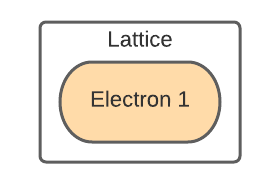

import Goto from '/src/components/Goto.js';

# Testing an Electron <Goto link="https://github.com/AgnostiqHQ/covalent/blob/develop/doc/source/how_to/coding/test_electron.ipynb" />

You can execute an electron in a single-task workflow by simply adding a lattice decorator to the function. This technique is useful for testing and debugging individual workflow tasks in a controlled manner.

## Prerequisites

Write an electron that you want to test individually.

```python
import covalent as ct

@ct.electron
def add(x, y):
   return x + y

```

## Procedure

Attach the `@lattice` decorator to the electron.

```python
import covalent as ct

@ct.lattice
@ct.electron
def add(x, y):
   return x + y
```



**Note**: Don’t confuse `ct.electron(lattice)`, which creates a sublattice, with `ct.lattice(electron)`, which is a workflow consisting of a single task.

## See Also

[Constructing an Electron](/docs/user-documentation/how-to/construct-electron)

[Constructing a Lattice](/docs/user-documentation/how-to/construct-lattice)

[Adding Electrons to Lattices](/docs/user-documentation/how-to/add-electron-to-lattice)
