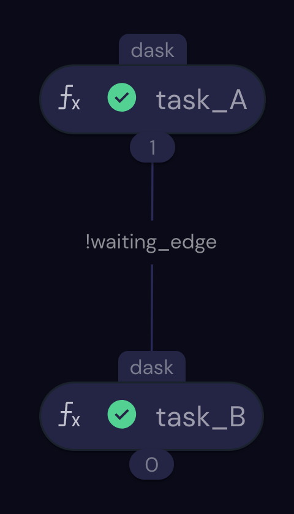

import Goto from '/src/components/Goto.js';

# Waiting for Execution of Another Electron <Goto link="https://github.com/AgnostiqHQ/covalent/blob/develop/doc/source/how_to/coding/wait_for_another_electron.ipynb" />

Covalent parallelizes execution of tasks (electrons) when their inputs and outputs are independent. You might nonetheless need an electron to wait for another electron to finish execution before starting.

The Covalent `Electron` class provides a method, `wait_for()`, that explicitly defers execution until another electron has finished executing.

## Prerequisites

Define a lattice where an electron `task_A` needs an electron `task_B` to complete before starting, even though the input of `task_A` does not depend directly on the output of `task_B`.

```python
import covalent as ct

@ct.electron
def task_A(**args_A):
    result_A = 1
    # Some task computation here
    return result_A

@ct.electron
def task_B(**args_B):
    result_B = 2
    # Some task computation here
    return result_B

```

## Procedure

Use the `ct.wait()` function to force `task_A` to delay start of execution until `task_B` is completed.

```python
@ct.lattice
def workflow():
    arg_A = 0
    arg_B = 0
    result_B = task_B(arg_B)
    result_A = task_A(arg_A)
    ct.wait(result_B, result_A) # Wait for result_A before computing result_B
```

In the example above, the call to `ct.wait(result_A, result_B)` creates the "artificial" dependency of `task_A` on `task_B`. The example produces this transport graph:



Note the edge between the two electrons is labeled `!waiting_edge` rather than with a parameter dependency.

Note also that the `ct.wait()` call appears in the workflow after the calls to both electrons. Recall that the lattice is run (and the transport graph built) before any electrons are executed; this enables the server to instantiate the dependency before dispatching the electrons.

In the following example, `task_3` waits for completion of `task_1` even though `task_3`'s execution does not directly depend on the output of `task_1`:

```python
import covalent as ct

@ct.electron
def task_1(a):
    import time
    time.sleep(3)
    return a ** 2

@ct.electron
def task_2(x, y):
    return x * y

@ct.electron
def task_3(b):
    return b ** 3

@ct.lattice
def workflow():
    res_1 = task_1(2)
    res_2 = task_2(res_1, 3)
    res_3 = task_3(5)
    ct.wait(res_3, res_1)

    return task_2(res_2, res_3)

dispatch_id = ct.dispatch(workflow)()
result = ct.get_result(dispatch_id, wait=True)
print(result)
```

    Lattice Result
    ==============
    status: COMPLETED
    result: 1500
    input args: []
    input kwargs: {}
    error: None

    start_time: 2023-02-17 00:48:57.309061
    end_time: 2023-02-17 00:49:00.525336

    results_dir: /Users/mini-me/agnostiq/covalent/doc/source/how_to/coding/results
    dispatch_id: a28b546f-7493-4eff-8dcb-c6425b87c804

    Node Outputs
    ------------
    task_1(0): 4
    :parameter:2(1): 2
    task_2(2): 12
    :parameter:3(3): 3
    task_3(4): 125
    :parameter:5(5): 5
    task_2(6): 1500

The `wait()` function can take a list of electrons rather than a single electron. The calling task waits until all electrons in the list are finished before executing.

In the following example, `task_3` waits for electrons 1a, 1b, and 1c before executing:

```python
import covalent as ct
import time


@ct.electron
def task_1a(a):
    time.sleep(1)
    return a ** 2

@ct.electron
def task_1b(a):
    time.sleep(1)
    return a ** 3

@ct.electron
def task_1c(a):
    time.sleep(1)
    return a ** 4

@ct.electron
def task_2(x, y):
    return x * y

@ct.electron
def task_3(b):
    return b ** 3

@ct.lattice
def workflow():
    res_1a = task_1a(2)
    res_1b = task_1b(2)
    res_1c = task_1c(2)
    res_2 = task_2(res_1a, 3)
    res_3 = task_3(5)
    ct.wait(res_3, [res_1a, res_1b, res_1c])

    return task_2(res_2, res_3)

dispatch_id = ct.dispatch(workflow)()
result = ct.get_result(dispatch_id, wait=True)
print(result)
```

    Lattice Result
    ==============
    status: COMPLETED
    result: 1500
    input args: []
    input kwargs: {}
    error: None

    start_time: 2023-02-17 00:49:01.456059
    end_time: 2023-02-17 00:49:02.663492

    results_dir: /Users/mini-me/agnostiq/covalent/doc/source/how_to/coding/results
    dispatch_id: 83885751-d800-4e36-b785-efa01e58c3be

    Node Outputs
    ------------
    task_1a(0): 4
    :parameter:2(1): 2
    task_1b(2): 8
    :parameter:2(3): 2
    task_1c(4): 16
    :parameter:2(5): 2
    task_2(6): 12
    :parameter:3(7): 3
    task_3(8): 125
    :parameter:5(9): 5
    task_2(10): 1500

Tip: Run the examples above and use the Covalent GUI to view the transport graphs.

The `wait()` function is especially useful when working with a dependent task that does not take any inputs and/or when you need to wait for classes that do not return an output.

## See Also

[Adding an Electron to a Lattice](/docs/user-documentation/how-to/add-electron-to-lattice)
