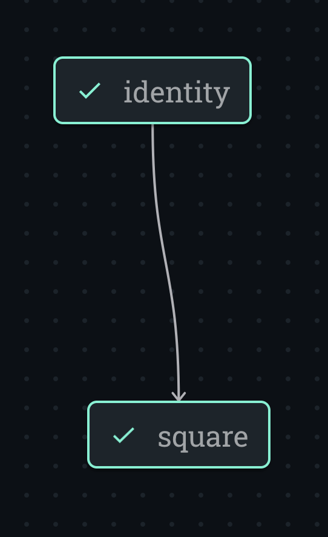

import Goto from '/src/components/Goto.js';

# Visualizing a Lattice <Goto link="https://github.com/AgnostiqHQ/covalent/blob/develop/doc/source/how_to/coding/visualize_lattice.ipynb" />

You can view the transport graph of a lattice in the Covalent GUI after you send the lattice to the Covalent dispatcher. Sometimes though you'll want to view the lattice structure before you run it or before it's even completed. The Covalent `Lattice` class contains a function that enables you to view a lattice at any time without dispatching it.

## Prerequisites

1. [Restart Covalent](/docs/user-documentation/how-to/execution/covalent-cli).

2. [Define a lattice](/docs/user-documentation/how-to/construct-lattice).

```python
import covalent as ct


@ct.electron
def identity(x):
    return x


@ct.electron
def square(x):
    return x * x


@ct.lattice
def workflow(a):
    val_1 = identity(x=a)
    return square(x=val_1)

```

## Procedure

To view a lattice at any stage:

1. Run the Covalent `lattice.draw()` function.

```python
workflow.draw(3)
```

2. In the Covalent GUI, go to the [Lattice Draw Preview](/docs/user-documentation/user-interface/preview-transport-graph) page.



## See Also

[Managing Covalent](/docs/user-documentation/how-to/execution/covalent-cli)

[Defining a Lattice](/docs/user-documentation/how-to/construct-lattice)

[Adding Electrons to Lattices](/docs/user-documentation/how-to/add-electron-to-lattice.md)

```python

```
